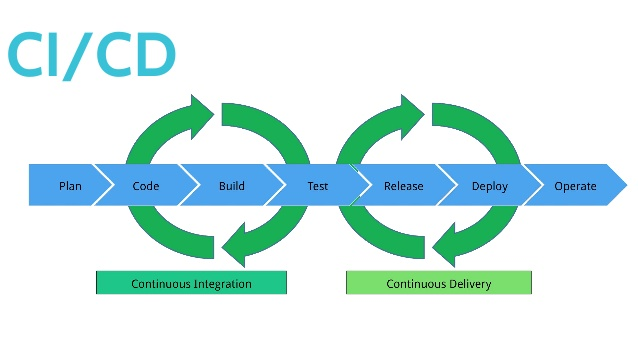
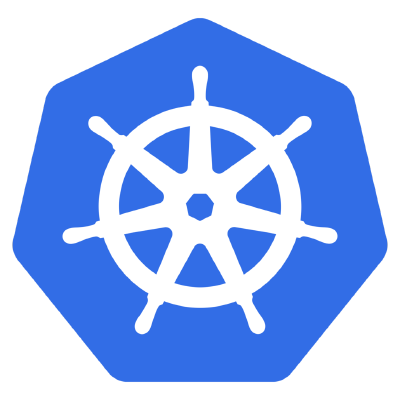

# Reto-DevOps CLM


Este reto fue diseñado para mostrar tus habilidades DevOps. Este repositorio contiene una aplicación simple en NodeJs.

## Proceso de Selección

Consta de 3 paso.
  1. Contacto de RRHH con el candidato, para evaluar cultura ....... y entrega de este reto.
  2. Entrevista con equipo técnico para evaluar el reto y conocernos
  3. Entrevista RRHH para oferta laboral.

## La app


```bash
$ git clone https://gitlab.com/clm-public/reto-devops.git
Cloning into 'reto-devops'...
remote: Enumerating objects: 3, done.
remote: Counting objects: 100% (3/3), done.
remote: Compressing objects: 100% (2/2), done.
remote: Total 3 (delta 0), reused 0 (delta 0)
Receiving objects: 100% (3/3), done.
$ cd ./reto-devops

```
### Instalar Dependencias
```bash
$ npm install
npm WARN basicservice@1.0.0 No repository field.
npm WARN optional SKIPPING OPTIONAL DEPENDENCY: fsevents@2.1.2 (node_modules/fsevents):
npm WARN notsup SKIPPING OPTIONAL DEPENDENCY: Unsupported platform for fsevents@2.1.2: wanted {"os":"darwin","arch":"any"} (current: {"os":"linux","arch":"x64"})

added 530 packages from 308 contributors and audited 1203947 packages in 34.589s

21 packages are looking for funding
  run `npm fund` for details

found 0 vulnerabilities
```
### Ejecutar Test


```bash
$ npm run test

> basicservice@1.0.0 test /basic-unit-test
> jest

 PASS  tests/sum.test.js
 PASS  tests/string.test.js

Test Suites: 2 passed, 2 total
Tests:       3 passed, 3 total
Snapshots:   0 total
Time:        5.655s
Ran all test suites.
```

### Ejecutar la app
```bash
$ node index.js
Example app listening on port 3000!
```
Podrá acceder a la API localmente en el puerto `3000`.

```bash
$ curl -s localhost:3000/ | jq
{
  "msg": "ApiRest prueba"
}
$ curl -s localhost:3000/public | jq
{
  "public_token": "12837asd98a7sasd97a9sd7"
}
$ curl -s localhost:3000/private | jq
{
  "private_token": "TWFudGVuIGxhIENsYW1hIHZhcyBtdXkgYmllbgo="
}
```

**NT:** En nuestro equipo consideramos que cada aplicación debe venir bien documentada por parte del desarrollador para que el equipo de **DevOps** puede realizar los procesos de automatización de una manera mas eficaz.

## El reto comienza aquí
Tienes que hacer un **fork** de este repositorio para completar los siguientes retos en tu propia cuenta de `gitlab`. **Siéntete libre de resolver el reto que desees.** La cantidad de retos resueltos nos va a permitir valorar tus habilidades y realizar una **oferta en base a las mismas**.

Una vez completado, no olvide notificar la solución **al contacto que indicó RRHH**.

**Tiempo de solucion 3 días**

Si tiene alguna duda, adelante, [abre un issue](https://gitlab.com/clm-public/reto-devops/issues) para hacer cualquier pregunta sobre cualquier reto.

### Reto 1. Dockerize la aplicación


¿Qué pasa con los contenedores? En este momento **(2020)**, los contenedores son un estándar para implementar aplicaciones **(en la nube o en sistemas locales)**. Entonces, el reto es:
1. Construir la imagen más pequeña que pueda. Escribe un buen Dockerfile :)
2. Ejecutar la app como un usuario diferente de root.

### Reto 2. Docker Compose


Una vez que haya dockerizado todos los componentes de la API *(aplicación de NodeJs y base de datos)*, estarás listo para crear un archivo docker-compose, en nuestro equipo solemos usarlo para levantar ambientes de desarrollo antes de empezar a escribir los pipeline.

### Reto 3. Probar la aplicación en cualquier sistema CI/CD


Como buen ingeniero devops, conoces las ventajas de ejecutar tareas de forma automatizada. Hay algunos sistemas de cicd que pueden usarse para que esto suceda. Elige uno, travis-ci, gitlab-ci, circleci ... lo que quieras. Danos una tubería exitosa. **Gitlab-ci** es nuestra herramienta de uso diario por lo cual obtendras puntos extras si usas gitlab.

### Reto 4. Deploy en kubernetes


Ya que eres una máquina creando contenedores, ahora queremos ver tu experiencia en k8s. Use un sistema kubernetes para implementar la API. Recomendamos que uses herramientas como minikube o microk8s.

Escriba el archivo de implementación (archivo yaml) utilizalo para implementar su API (aplicación Nodejs - Base de Datos).

* **Ten en cuenta los volúmenes de la base de datos**.

### Reto 5. Construir Chart en helm y manejar trafico http(s)


Realmente el pan de cada día es crear, modificar y usar charts de helm. Este reto consiste en:

1. Diseñar un chart de helm con nginx que funcione como proxy reverso a nuesta app Nodejs
2. Asegurar el endpoint /private con auth_basic
3. Habilitar https y redireccionar todo el trafico 80 --> 443

### Reto 6. Terraform


En estos días en IaC no se habla de más nada que no sea terraform, en **CLM** ya nos encontramos con pipeline automatizados de Iac. El reto consiste en crear un modulo de terraform que nos permita crear un **rbac.authorization de tipo Role** que solo nos permita ver los pods de nuestro **namespace donde se encuentra al app Nodejs**

### Reto 7. Automatiza el despliegue de los retos realizados


Ya que hoy en día no queremos recordar recetas ni comandos, el reto consiste en **automatizar los retos en un Makefile**, considera especificar cuales son las dependencias necesarias para que tu Makefile se ejecute sin problemas.

**NT:** Se evaluará el orden en el cual se encuentre el repositorio, en el gran universo de aplicaciones que existe hoy en día el orden es un factor importante.
